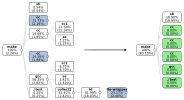

# Firebuild


## Introduction

Firebuild is an automatic build accelerator. It works by caching the outputs of executed commands
and replaying the results when the same commands are executed with the same parameters within the
same environment.

The commands can be compilation or other build artifact generation steps, tests, or any command that
produces predictable output. The commands to cache and replay from the cache are determined
automatically based on `firebuild`'s [configuration](etc/firebuild.conf) and each command's and its
children's observed behavior.



## Usage

Prefix your build command with `firebuild`:

    firebuild <build command>

The first build is typically a 5-10% slower due to the overhead of analyzing the build and populating
the cache. Successive builds can be 5-20 times or even faster depending on the project and the changes
between the builds.

### Improving hit rate

If the hit rate (check with `firebuild -s`) is not at the expected levels run firebuild with `-d proc`
to see why particular commands can't be stored to the cache or with `-d shortcut` to see what prevents
shortcutting of particular commands.

Firebuild can also generate a report about the whole build process with `firebuild -r <build command>`
that helps finding the slowest parts of the build and also helps finding what could not be shortcut.

#### Clang PCH's embedded timestamps prevents shortcutting

Clang embeds timestamps in precompiled headers (PCHs) by default on Linux in the PCH generation
steps (`-emit-pch`). To let Firebuild cache PCHs use `-Xclang -fno-pch-timestamp` with `clang`.

## How it compares to other build accelerators?

### Ccache, sccache and other compiler wrappers

Ccache works by having an understanding of how the C/C++ compiler works and it supports only the
C/C++/Obj-C family of languages. Sccache adds Rust on top of those, and the concept is the same.

Firebuild supports accelerating any command that behaves reasonably well, like not downloading
files from the network to produce output. As a result you can accelerate the linker (even with LTO)
, or the configure and code generation steps of C/C++ project builds, which together made it
consistently beat ccache in [our testing](https://github.com/firebuild/firebuild-infra/pull/59).

Firebuild also supports many other compilers, such as Fortran, Java (including Javadoc
generation) and Scala compilers which are not accelerated by ccache.

### Bazel and similar build systems

Bazel requires maintaining the Bazel build system, while Firebuilds works with any
build system that does not implement its own caching. You just need to prefix your build command
with firebuild, like it is done for accelerating bash's build in the autopkgtest:
[debian/tests/recompile-bash](debian/tests/recompile-bash)

```
...
Build times:
real1=88.28
user1=113.08
sys1=26.20
real2=12.38
user2=8.31
sys2=5.67
CPU time of the second build was 10% of the first build
autopkgtest [14:24:12]: test recompile-bash: -----------------------]
recompile-bash       PASS
```
You can even accelerate a single command without any build system: `firebuild <command>`.

### Firebuild shortcomings

Firebuild does not support [compressing cache entries](https://github.com/firebuild/firebuild/issues/1087), nor [remote caches](https://github.com/firebuild/firebuild/issues/19) yet.

Firebuild's interception works by preloading libfirebuild.so to the intercepted processes and interposing libc and system calls. As a result it can't intercept nor shortcut statically linked binaries.

## Installation

Firebuild is available in [Arch Linux (AUR)](https://aur.archlinux.org/packages/firebuild),
[Debian](https://tracker.debian.org/pkg/firebuild),
[Ubuntu](https://launchpad.net/ubuntu/+source/firebuild),
and other Debian derivatives.

Back-ported packages for supported Ubuntu releases can be downloaded from the [official PPA](https://launchpad.net/~firebuild/+archive/ubuntu/stable):

    sudo add-apt-repository ppa:firebuild/stable
    sudo apt install firebuild

If you would like to use `firebuild` in your GitHub pipeline there is a [GitHub Action](https://github.com/marketplace/actions/firebuild-for-github-actions) to do just that.

## Building from source

### On Linux

For Ubuntu earlier than 21.04 (xxhash earlier than 0.8.0 or Valgrind earlier than 3.17.0):

    sudo apt-add-repository ppa:firebuild/build-deps
    
Install the build dependencies:

    sudo apt update
    sudo apt install clang cmake bats bc graphviz libconfig++-dev node-d3 libxxhash-dev libjemalloc-dev libtsl-hopscotch-map-dev moreutils python3-jinja2 fakeroot

Build:

    cmake . && make check

Install:

    sudo make install

### On Mac

Install the build dependencies:

    brew bundle

Build:

    export XML_CATALOG_FILES=/usr/local/etc/xml/catalog
    cmake .
    make check

Install:

    sudo make install

Set up the system to allow intercepting builds: https://firebuild.com/setup-macos
